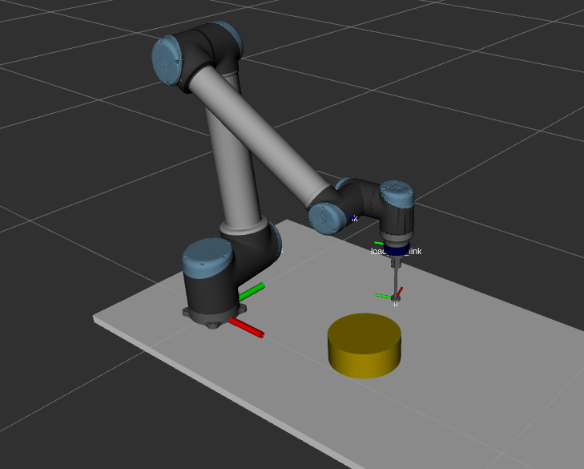

# Contour following to demonstrate dual control and estimation

This code is used to perform planar contour following with the UR10 robot, using the task function approach to perform both control and estimation. 

The application is implemented by modifying the [eTaSL application template ](https://gitlab.kuleuven.be/etasl/etasl_application_template). More information about the template is provided in the original readme below. In summary, the following is changed from the application template:

### Modified/Added files

- [contour_following_SEAC.lua](/scripts/etasl/controller_specification_files/contour_following_SEAC.lua) This file contains the etasl specification for both the controller and the estimator.
- [deploy_SEAC.lua](/scripts/deploy/deploy_SEAC.lua) Contains the orocos deployment file to launch the controller and relevant components.
- [fsm_planar_contour_SEAC.lua](/scripts/rfsm/fsm_planar_contour_SEAC.lua) Contains the finite state machine, containing the approach motion and the contour following.


### Running the software

<!--  -->


This package includes a basic simulation environment simulating the contour following with a circular contour (shown in the figure). To run the simulation, run the following commands:

Launch ros with rviz to visualize the contour following:
- `roslaunch planar_contour_following load_setup_ur10_seac.launch`

Run the deployer file to deploy finite state machine with controller. Make sure to run this command from within the `scripts/deploy` folder.
- `rttlua -i deploy_SEAC.lua` 

To launch on a real robot, follow the instructions below regarding the application template.

# eTaSL Application Template

This template can be use whenever creating a new catkin package that involves eTaSL and etasl-rtt (eTaSL Orocos component). It provides a structure for organizing the different files and functionalities that are typical in any robot application.
## I. Installation

### Installation of template
If you don't know what a catkin workspace and an etasl workspace is, please refer to  [Tutorial 2 - eTaSL Workspaces and Packages](https://gitlab.kuleuven.be/etasl/tutorial_etasl/-/blob/master/tutorials/workspaces_and_packages.md), before atempting to use this template.

The steps for installing the template are the following:

1. Clone the template in the src folder of your workspace:
```bash
cd <your_workspace_directory>/src
git clone https://gitlab.kuleuven.be/etasl/planar_contour_following
```
2. Delete the local git repository
```bash
cd planar_contour_following
rm -rf .git
```
3. Change the name of the template with a custom name with the assistance of a script that will guide you through the process:
```bash
source configure_template.sh
```
4. Initialize a new git repository (optional but recommended):
```bash
git init
git add .
git commit -m "Initial Commit"
```

5. Build the package
```bash
cd ..
source devel/setup.bash
catkin_make
```

### Installation of Robot dependencies
In this template there are already 4 ready-to-use robots which you can select easily and execute the application either in simulation or with the real robot (see [Tutorial 3 - Deploying Robot Applications](tutorials/deploying_application.md)). However, for each of them, you need to install two packages within your workspace. The first package corresponds to the description of the robot, which includes the robot model in a [URDF](http://wiki.ros.org/urdf/Tutorials) format. This package is needed for deploying the task in simulation as well as deploying the task in the real robot. The second package is the Orocos driver (see [Tutorial 5 - Using another robot](tutorials/other_robots.md)), which is not needed for simulation. In the following section, we will explain where you can find each of the two aforementioned packages for each of the supported robots.

**Note:** each of the drivers has additional functionalities which are not included in the template. Please read the corresponding readme file the driver that you want to use, since that can be useful when programming your own tasks (e.g. some drivers can provide force feedback).

**Important!** Each driver has a supported version of the firmware of the robot and computer OS that may or may not be the most recent. For newer versions the driver could work as it is, or it could need an update.

**Universal Robots - UR10**
- *Robot Description -* Download the [ros-Industrial universal_robot](https://github.com/ros-industrial/universal_robot) package and copy the folder *ur_description* in your *src* folder of your workspace. We just need the *ur_description*, so you can delete the rest of the package.
- *Orocos Driver -* Clone the [URDriver](https://github.com/gborghesan/URDriver) into the *src* folder of your workspace and follow a standard catkin_make procedure to build it.

**Kinova - Gen3**
- *Robot Description -* Download the [ros_kortex](https://github.com/Kinovarobotics/ros_kortex) package and copy the folder *kortex_description* in your *src* folder of your workspace. We just need the *kortex_description*, so you can delete the rest of the package.
- *Orocos Driver -* Clone the [kinova_orocos_driver](https://github.com/santiregui/kinova_orocos_driver) into the *src* folder of your workspace. Then follow the installation procedure described in the readme file of the package.

**Franka Emika - Panda**
- *Robot Description -* Download the [franka_ros](https://github.com/frankaemika/franka_ros) package and copy the folder *franka_description* in your *src* folder of your workspace. We just need the *franka_description*, so you can delete the rest of the package.
- *Orocos Driver -* Clone the [orocos_franka_panda](https://github.com/santiregui/orocos_franka_panda) into the *src* folder of your workspace. Then follow the installation procedure described in the readme file of the package.

**KUKA - iiwa**
- *Robot Description -* Download the [lbr_iiwa](https://github.com/rtkg/lbr_iiwa) package and copy the folder *lbr_iiwa_description* in your *src* folder of your workspace. We just need the *lbr_iiwa_description*, so you can delete the rest of the package.
- *Orocos Driver -* Clone the [iiwa_fri_rtt](https://github.com/yudhapane/iiwa_fri_rtt) into the *src* folder of your workspace. Then follow the installation procedure described in the readme file of the package.

After you have the corresponding packages in the src folder of your workspace, build your packages with catkin_make.


## II. Package Structure
This is an eTaSL (catkin-based) package that is structured as follows:
- **planar_contour_following**
  - **env-hooks**
    - `10.template_lua_configure_paths.sh.develspace.in`: This adds relevant directories to the LUA_PATH and LUA_CPATH environment variables. It is called in the CMakeLists.txt when building the package with catkin_make.
  - **launch**
    - `load_setup.launch`: launch the visualization of the robot
    - `load_setup_fake_joint_states.launch`: launch the visualization of the robot with a GUI to send joint values
  - **reports**
    - **all_data** (*This folder contain the reports of the ports organized by day. Each file contains the corresponding timestamp*)
  - **robot_description**
    - `environment_config.rviz`: configuration file for rviz
    - **meshes** (*folde with stl files of the setup*)
    - **urdf**
      - `robot_tools.urdf.xacro`: xacro file with the definition of the tools mounted on the robot
      - `environment.urdf.xacro`: xacro file with the definition of the environment
      - `use_case_setup.urdf.xacro`: xacro file combining the robot + tools + environment
      - `use_case_setup.urdf`: urdf file with the setup description that is read by eTaSL
  - **scripts**
    - **components**
      - `fsm_component.lua`: default component for rfsm
      - `simple_robot_sim.lua`: Component that replaces the robot driver in simulation mode. It takes the joint velocity output of the controller and returns joint positions (simple numeric integration).
    - **deploy**
      - `deploy_general.lua`: general file to deploy a robot application
    - **etasl**
      - `move_admittance.lua`: eTaSL specification to let the robot follow the human motions
      - `move_cartesian_frame.lua`: eTaSL specification to command the robot displace along a an axis frame
      - `move_jointspace_trap.lua`: eTaSL specification to command the robot to move in *joint space* following a trapezoidal velocity profile
      - `move_motion_model.lua`: eTaSL specification to command the robot to move following a learned model
      - `ports.lua`: eTaSL specification to define default I/O ports
      - `robot_ur10.lua`: eTaSL specification to read *`robot_description/urdf/use_case_setup.urdf`* and define the frames to be used
      - `test_skills.lua`: eTaSL specification to debug the task specification before deploying the application by running `ilua.lua`
      - **learned models** (*folder containing json files with the learned models*)
    - **lib**
      - `etasl_FT_JR3.lua`: functions to deploy the JR3 F/T sensor + a component to filter and transform the wrench signals
      - `etasl_UR10.lua`: functions to deploy the UR10 driver
      - `JSON.lua`: module to read JSON files in lua
      - `motion_model.lua`: eTaSL module to generate signals from a learned models
      - `utils_ts.lua`: Useful lua module with functions for etasl task specifications.
    - **rfsm**
      - `fsm_general.lua`: General definition of the state machine. Each task specification is defined as a state

## III. Instruction to run built-in examples
**Note:** We use the *etasl_application_example* as the name of the package, but you probably changed it part of the installation procedure described in section II.
1. Source your workspace
```
source <your workspace directory>/devel/setup.bash
```

**Terminal A - Visualization**:
Launch the rviz visualization launch the following command:
  ```
  roslaunch etasl_application_example load_setup.launch
  ```
**Note:** This step is not necesary when deploying the task in the real robot (simulation = false).

**Terminal B - Deploy the application**
Go to the *deploy* folder

```
roscd etasl_application_example/scripts/deploy
```
and then run
```
rttlua -i deploy_general.lua
```

Alternatively, run the following for a more interactive console that allows you to debug easily:
```
irttlua.lua deploy_general.lua
```

## IV. Code insights

The most important files that you need to be are of are the following

### URDF folder
Here you define your application setup (e.g. change the robot tool, add objects for visualization, etc). It is very important to have clear the concept of frame transformations. To get familiar with the *Universal Robot Description Language* (URDF) you can refer to <http://wiki.ros.org/urdf>

Xacro files are useful to parametrized the robot description, however, to deploy an eTaSL application you need to generate a urdf file. To do so, you first go to the folder containing the URDF descriptions

```
roscd planar_contour_following/robot_description/urdf
```
and then
```
rosrun xacro xacro use_case_setup.urdf.xacro > use_case_setup.urdf
```

If your ROS version is old and you get an error, use xacro.py instead (now deprecated)
```
rosrun xacro xacro.py use_case_setup.urdf.xacro > use_case_setup.urdf
```
**Note**: For a fast way to see your robot definition you can run: `roslaunch etasl_application_example load_setup_fake_joint_states_ur10.launch`. If you are using an updated version of ROS, you might need to install the joint_state_publisher_gui by running `sudo apt update` and
`sudo apt install ros-<your_ROS_version>-joint-state-publisher-gui`


### Deployer
It contain the orocos deployer file with the definition of all the components and connections between them.

### eTaSL folder
In these files all robot **rock and roll** happens.
The main idea is to brake them down to have functions that can be easily composed.
As a first attempt, the task specification is composed by sections that correspond to behavior definitions.

- The file *ports.lua* let generate default ports to facilitate the deployment of the eTaSL component.
- The file *robot.lua* reads the robot description and contains the frame definition.
- Each etasl specification contains the following features:
  - Definition of the TCP frame used.
  - I/O ports to get in and out the corresponding signals.
  - Behaviors definition separated by blocks of code.
  - Parameters defined as input channels.

### fsm_general.lua

It contains the definition of the different states. Each estate corresponds to a reconfiguration of the eTaSL component (e.g. changing the task specification) or to other types of states (e.g. configure, finish, activate gripper, etc).

- Transitions should be defined by the user of this template.
- Transitions from an eTaSL specification are triggered by default by an event `"e_finished@etaslcore"`
- It is possible to define custom events e.g., `"e_admittance"`. To trigger them use the *cmd port* defined in *deploy_general.lua*
```lua
cmd:write("e_admittance")
``` -->
